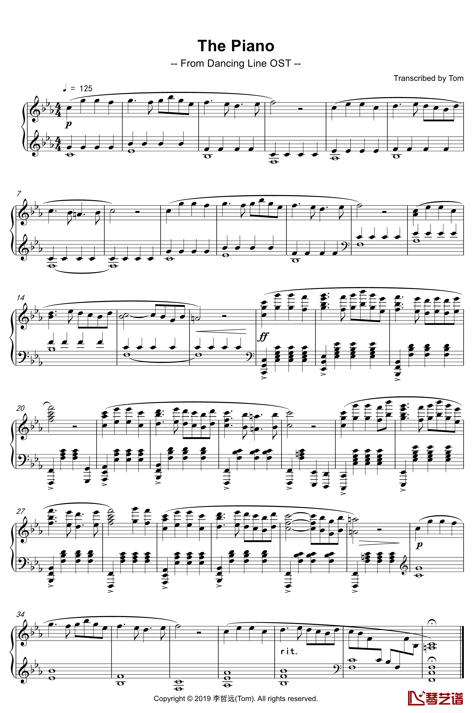

It's a Logic Pro X project.The Piano is the sound track of Dancing Line.The soundtrack is inspired by [Empire of Angels](https://www.youtube.com/watch?v=izsjRpcgfmk), composed by [Thomas Bergersen](https://en.wikipedia.org/wiki/Thomas_Bergersen).

[**The Piano**](https://music.163.com/dj?id=2056688191&userid=264605415) 是游戏 **Dancing Line**(跳舞的线)的游戏配乐。其灵感来源于大名鼎鼎的 [**Thomas Bergersen**](https://baike.baidu.com/item/Thomas%20Bergersen) 的经典作曲 [Empire Of Angels](https://music.163.com/song?id=29460377&userid=264605415)。本项目为 The Piano 的 Logic Pro x 工程文件，属于个人即兴扒谱，未能100%还原，如果你有好的想法请 **issue** 或者 **pr**

### The Piano 五线谱

